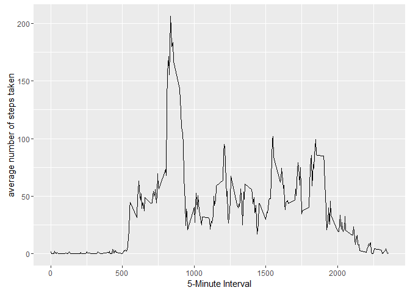

# Reproducible Research: Peer Assessment 1


## Loading and preprocessing the data


```r
unzip(zipfile="activity.zip")
activityData <- read.csv("activity.csv")
```

## What is mean total number of steps taken per day?


```r
library(ggplot2)
```

```
## Warning: package 'ggplot2' was built under R version 3.2.3
```

```r
total.steps <- tapply(activityData$steps,activityData$date,sum,na.rm=TRUE)
qplot(total.steps, binwidth=1000, xlab="total number of steps taken each day")
```

\

```r
mean(total.steps,na.rm=TRUE)
```

```
## [1] 9354.23
```

```r
median(total.steps,na.rm=TRUE)
```

```
## [1] 10395
```

## What is the average daily activity pattern?

```r
averages <- aggregate(x=list(steps=activityData$steps), by=list(interval = activityData$interval),mean,na.rm=TRUE)

ggplot(data = averages,aes(x=interval,y=steps)) + geom_line()+
    xlab("5-Minute Interval")+ylab("average number of steps taken")
```

\

```r
averages[which.max(averages$steps),]
```

```
##     interval    steps
## 104      835 206.1698
```
## Imputing missing values

```r
missing <- is.na(activityData$steps)
table(missing)
```

```
## missing
## FALSE  TRUE 
## 15264  2304
```

```r
library(Hmisc)
```

```
## Warning: package 'Hmisc' was built under R version 3.2.5
```

```
## Loading required package: lattice
```

```
## Loading required package: survival
```

```
## Loading required package: Formula
```

```
## Warning: package 'Formula' was built under R version 3.2.3
```

```
## 
## Attaching package: 'Hmisc'
```

```
## The following objects are masked from 'package:base':
## 
##     format.pval, round.POSIXt, trunc.POSIXt, units
```

```r
activityDataModified <- activityData
activityDataModified$steps <- impute(activityData$steps,fun=mean)
modified.steps <- tapply(activityDataModified$steps,activityDataModified$date,sum)
qplot(modified.steps, binwidth=1000, xlab="total number of steps taken each day")
```

\

```r
mean(modified.steps)
```

```
## [1] 10766.19
```

```r
median(modified.steps)
```

```
## [1] 10766.19
```


## Are there differences in activity patterns between weekdays and weekends?

```r
activityDataModified$dateType <-  ifelse(as.POSIXlt(activityDataModified$date)$wday %in% c(0,6), 'weekend', 'weekday')
avgactivityDataModified <- aggregate(steps ~ interval + dateType, data=activityDataModified, mean)

ggplot(avgactivityDataModified, aes(interval, steps)) + 
    geom_line() + 
     facet_grid(dateType ~ .) +
     xlab("5-minute interval") + 
     ylab("avarage number of steps")
```

\
